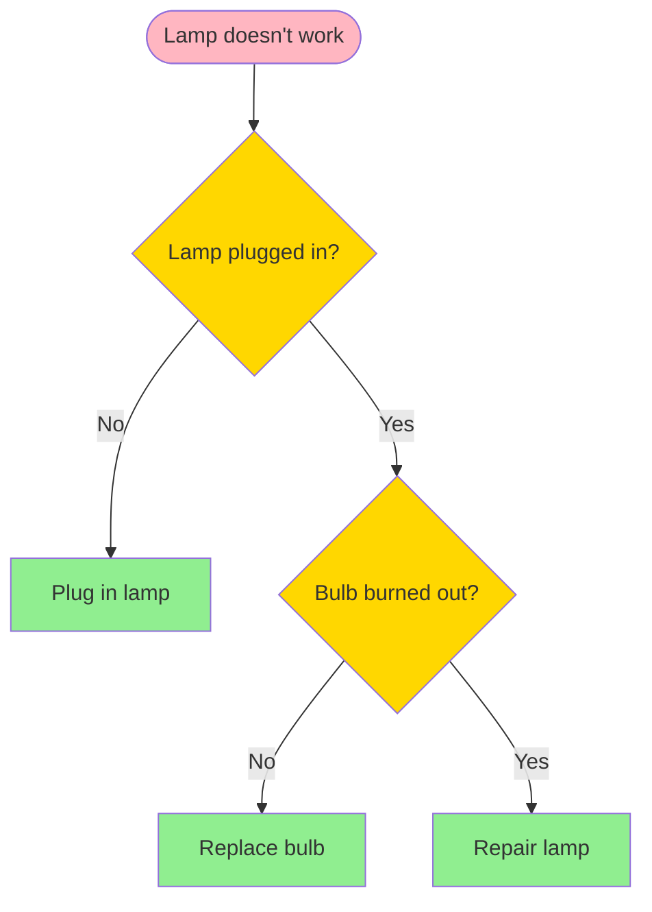

# Lamp Troubleshooting Flowchart

```mermaid
flowchart TD
    Start([Lamp doesn't work]) --> CheckPlug{Lamp plugged in?}
    CheckPlug -->|No| PlugIn[Plug in lamp]
    CheckPlug -->|Yes| CheckBulb{Bulb burned out?}
    CheckBulb -->|No| ReplaceBulb[Replace bulb]
    CheckBulb -->|Yes| RepairLamp[Repair lamp]
    
    style Start fill:#ffb6c1
    style CheckPlug fill:#ffd700
    style CheckBulb fill:#ffd700
    style PlugIn fill:#90ee90
    style ReplaceBulb fill:#90ee90
    style RepairLamp fill:#90ee90
```
